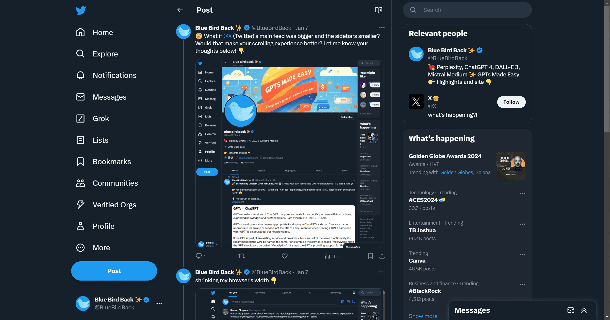
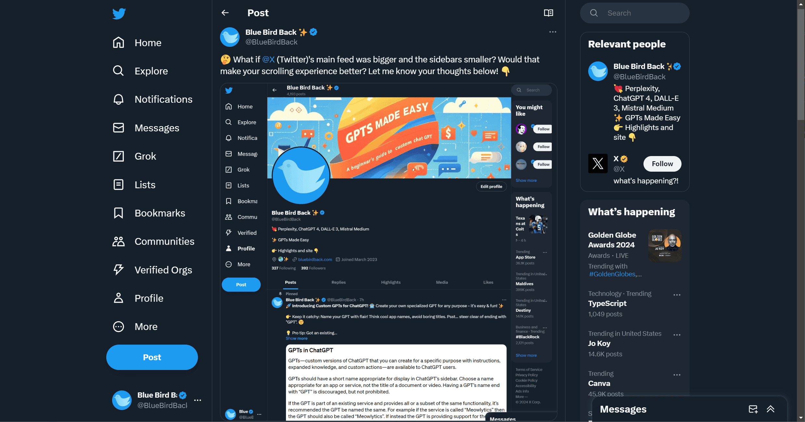
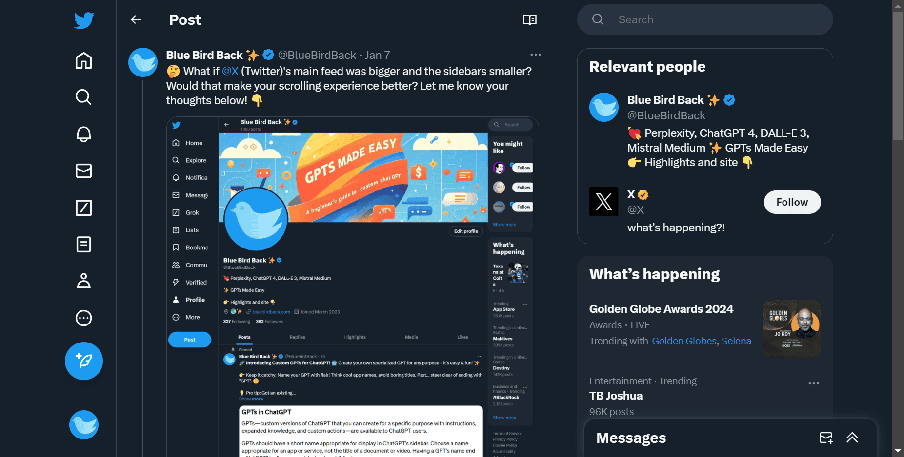

# x-twitter-column-resizer

Resizes X (formerly Twitter) columns for a better layout.

## Example

https://twitter.com/BlueBirdBack/status/1744168765640540241

X (formerly known as Twitter) has a three-column design. Changing the widths from 275px, 600px, and 350px to 230px, 720px, and 230px respectively improves its look.

### width of 1651px

Before using the extension.

After using it.

### width of 1235px

Before using the extension.

After using it.

